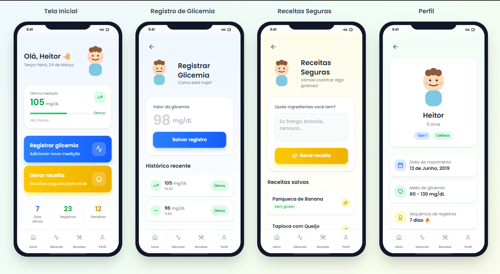
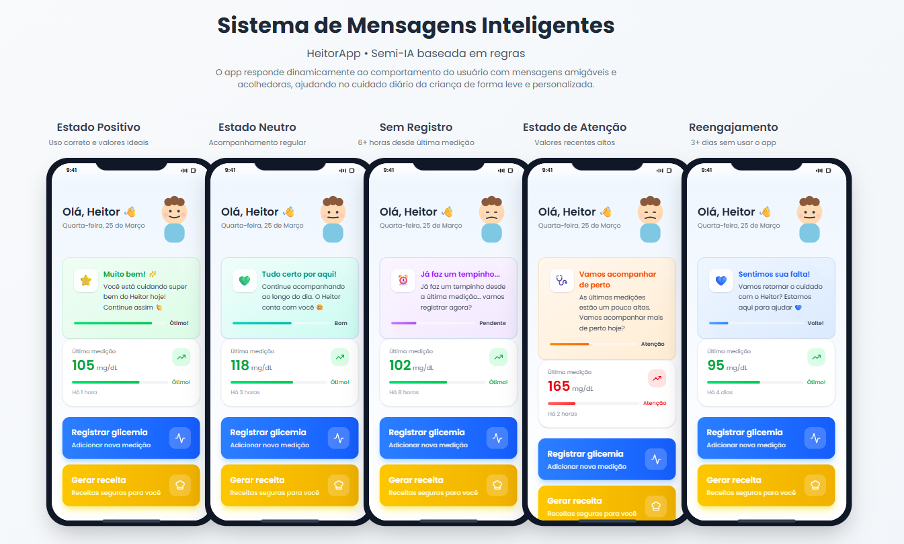

# 📱 HeitorApp

> 💙 Um app criado com propósito: transformar cuidado em rotina leve e inteligente.

O **HeitorApp** é uma aplicação em desenvolvimento focada no acompanhamento da glicemia infantil, com uma abordagem humanizada, visual e baseada em feedback inteligente.

---

## 💡 Origem do Projeto

O HeitorApp nasceu inicialmente como uma solução pessoal, pensada para auxiliar no acompanhamento da saúde de uma criança próxima.

Com o tempo, o projeto evoluiu e passou a ser estruturado como um produto que pode ajudar **outras crianças e responsáveis**, mantendo sempre sua essência:

> cuidado próximo, simples e humano.

---

## 🚀 Visão do Produto

O objetivo do HeitorApp é ir além do registro de dados.

A proposta é:

* Facilitar o acompanhamento da glicemia
* Tornar a rotina mais leve e organizada
* Oferecer feedback inteligente ao usuário
* Criar uma experiência acolhedora e intuitiva

---

## 🧠 Diferencial

### 🤖 Sistema de Mensagens Inteligentes

O app responde ao comportamento do usuário e aos dados registrados:

* ✅ **Estado Positivo** — níveis controlados
* ⚖️ **Estado Neutro** — acompanhamento normal
* ⏰ **Sem Registro** — ausência de medições
* ⚠️ **Estado de Atenção** — valores elevados
* 🔁 **Reengajamento** — retorno ao uso

➡️ Isso transforma o app em um **assistente de cuidado**, não apenas um registrador de informações.

---

## 📸 Preview do Projeto

### 🏠 Tela Inicial e Fluxos Principais

---

### 🤖 Sistema de Feedback Inteligente

---

## 🎨 Design & Experiência

O design foi desenvolvido no Figma com foco em:

* Interface mobile-first (estilo app real)
* Hierarquia visual clara
* Uso de cores semânticas (verde, amarelo, vermelho)
* Feedback visual baseado no estado da glicemia
* Linguagem amigável e humanizada

---

## 🛠️ Tecnologias

* **TypeScript**
* **React (em implementação)**
* **PWA (Progressive Web App)**
* Planejado: **Capacitor** (transformação em app mobile)

---

## 📱 Roadmap

### 🔹 Em desenvolvimento

* [x] Protótipo completo no Figma
* [x] Definição de fluxos e estados
* [ ] Implementação das telas
* [ ] Componentização
* [ ] Responsividade

### 🔹 Próximos passos

* [ ] Lógica de estados da glicemia
* [ ] Persistência de dados
* [ ] Feedback dinâmico inteligente
* [ ] Transformação em app mobile
* [ ] Publicação na Play Store

---

## 🚧 Status do Projeto

> ⚠️ Em desenvolvimento ativo

O projeto está em evolução contínua, com foco em aprendizado, design de produto e construção de uma aplicação real.

---

## 🧠 Aprendizados

Este projeto envolve:

* Product Thinking
* UX/UI Design
* Estruturação de aplicações
* Desenvolvimento com TypeScript
* Construção de um produto do zero

---

## 👩‍💻 Autora

**Flávia Hipolito**
Em desenvolvimento na área de tecnologia e produto digital 🚀

---

## ⭐ Observação

O nome **HeitorApp** foi mantido por representar a origem do projeto e sua motivação inicial.

Ele carrega a ideia de um cuidado próximo e real — algo que continua sendo o coração do produto, mesmo com seu potencial de crescimento.

